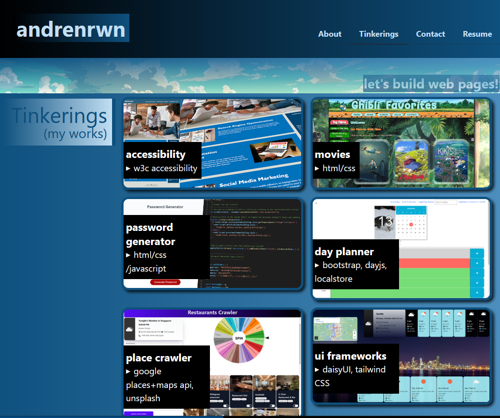

# mywebsite

\
[Link to Site](https://beautiful-raindrop-05b798.netlify.app/)

## Description

This is a react website I use to store things that I am interested in and various personal projects.\n
It contains the technologies I worked with and resume.\n
Thanks for visiting!

## Usage

Click on the tabs on the top nav bar or the footer nav bar to move around and explore.

## Components

- React
- Vite - development server
- TailwindCSS + DaisyUI - UI framework
